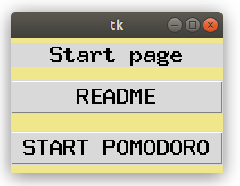
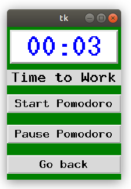

# Pomodoro_GUI_in_Python

## Python for time management.

A personal Pomodoro app written from scratch in Python. An attempt to create personal Pomodoro with additional settings such as tracking my own progress, adjustable settings, easy to use application with a nice GUI interface. 

The app (in its final developed stage) is intended to be easy to use and versatile. Not only to give an opportunity to change the standard time range to the user preferences but also to track the number of accomplished work/break cycles and give potentially some statistics on your preformance.

### What is a Pomodoro?

The Pomodoro Technique is a time management method developed by Francesco Cirillo in the late 1980s. The technique uses a timer to break down work into intervals, traditionally 25 minutes in length, separated by short breaks (usually 5 minutes and 15-minute longer breaks). Each interval is known as a pomodoro, from the Italian word for 'tomato', after the tomato-shaped kitchen timer that Cirillo used as a university student (source: Wikipedia).

The program works in a standard way by switching in between the regimes:
work - short break 
work - short break
work - long break
(again)
2 x work - 2 x short break
work - long break 
...
(and so on)

1) Amongt the following files, a simple GUI app is a starting point of a GUI app. 
For more details on tkinter module and a button response you can check [this link](https://www.tutorialspoint.com/python/tk_button.htm), for example.

The code contains a button, which calls the response message, nothing less, nothing more. You can run it in terminal as:
```
python Simple_GUI_app.py
```

Initial display is shown in the following image.




2) Next, is "Initial_Pomodoro_GUI.py" app. It contains the initial GUI interface of the Pomodoro app. 

It includes a main window and two sub-windows/frames which contain a README and a Pomodoro App itself. You can switch between the frames by pushing the respective buttons. 

You can check out this post, for example, on how to switch between frames in tkinter GUI [this link](https://www.delftstack.com/howto/python-tkinter/how-to-switch-frames-in-tkinter/). The main working window is intuitive and contains the buttons to "Start" and "Pause" the counter, making it suitable for everyone who would like to take longer beaks or simply needs to urgently break a work-flow.

You can run the program from terminal such as:
```
python Initial_Pomodoro_GUI.py
```

The working window is displayed below.



If you have any comments, questions, suggestions, or just want to connect, my contacts are below. 


## Contacts

[LinkedIn](https://www.linkedin.com/in/ruslan-brilenkov/)

[Original article](https://medium.datadriveninvestor.com/create-productivity-app-in-python-from-scratch-part-1-d715d1f393db)
